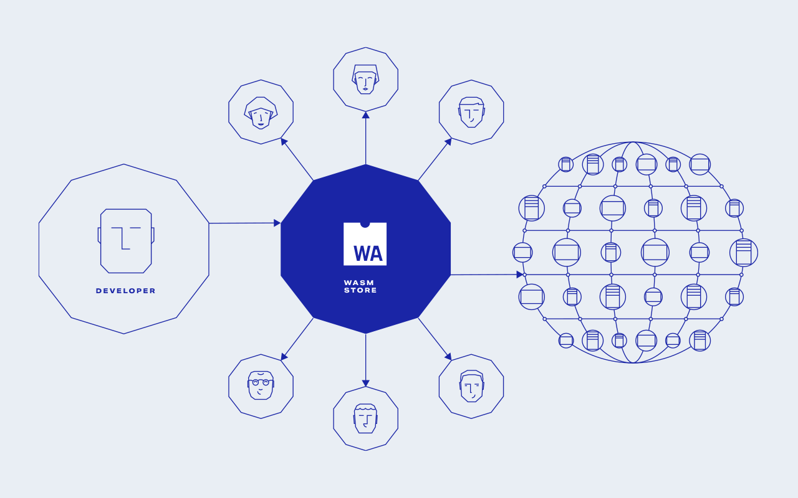
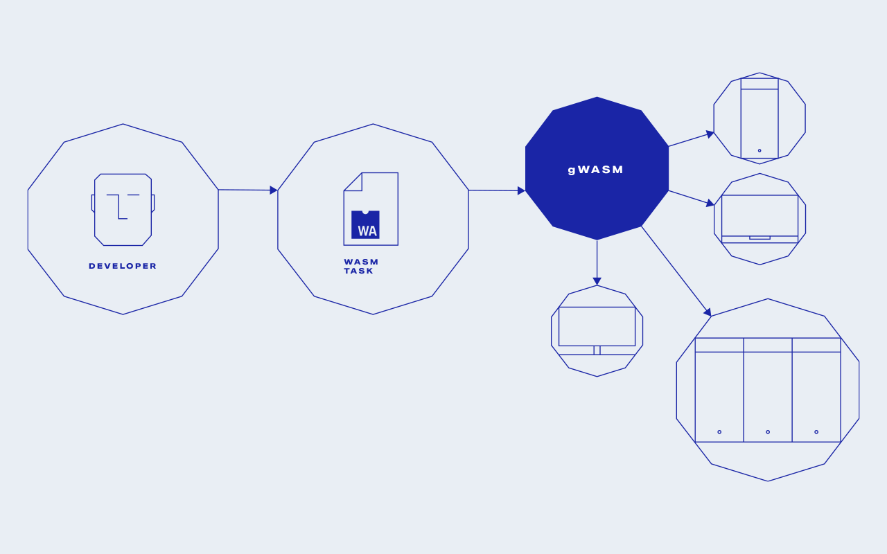

# gWASM

?> Any code that can be compiled to [WASM](https://webassembly.org/), can be distributed on [Golem Network](/../About/What-is-Golem). gWASM allows you to run WebAssembly binaries on providers’ machines by turning WASM into a container for server-side parallel computations.

There are two flows in which one can interact with gWASM:

#### 1. Decentralized backend for your apps

With gWASM, it is easy to create a decentralized application supported by the gWASM backend. You can also integrate existing applications and services by moving computationally expensive parts to the Golem platform.
If you want to give it a try check [how to compile gWASM application](Products/gWASM/Building-gWASM-applications?id=how-to-compile-gwasm-application) and take a look our [sample application - g-flite](Products/gWASM/Sample-application) as a reference of your own app.

#### 2. Run your code in a decentralized network

gWASM is an easy-to-use platform for distributed and parallel computations. Convert your code to a WebAssembly binary and execute it in a decentralized manner - within the Golem Network. If you want to give it a try, learn how to [Create gWASM tasks in Golem](Products/gWASM/gWASM-tasks)

?> In our gWASM integration, your data and WASM binary is transferred to the remote machine and executed. The target machine is secured by the in-sandbox execution. The binary is portable and compatible with various OS and environments since it is executed by a runtime engine rather than natively. The solution is designed to run large number of computations in parallel in order to profit from Golem Network capabilities.

---

#### Quick links

?> After [testing gWASM locally](Products/gWASM/Quick-start) please remember to [download and install Clay Golem](https://docs.golem.network/#/Products/Clay-Beta/Installation) or [Golem Unlimited](/Products/Unlimited/Basic-Usage) as it is required to run in the background during gWASM computations.

* [Quick start - testing gWASM locally](Products/gWASM/Quick-start)
* [gwasm-runner](Products/gWASM/gWASM-applications?id=gwasm-runner) is a project with a single goal: making developing new gWASM apps as simple as possible
* Learn how to [Create gWASM tasks in Golem](Products/gWASM/gWASM-tasks)
* Learn [how to build gWASM application](Products/gWASM/Building-gWASM-applications)
* Check our [sample application - g-flite](Products/gWASM/Sample-application) as a reference of your own app if you are a Developer. It is also **the simplest way to play around with gWASM if you are not a developer**

---

#### Feedback

If you would like to share your thoughts about **gWASM** please fill out this **[short survey](https://forms.gle/7Kury1nuLNe3Wf656)**. It will help us make your experience better.
