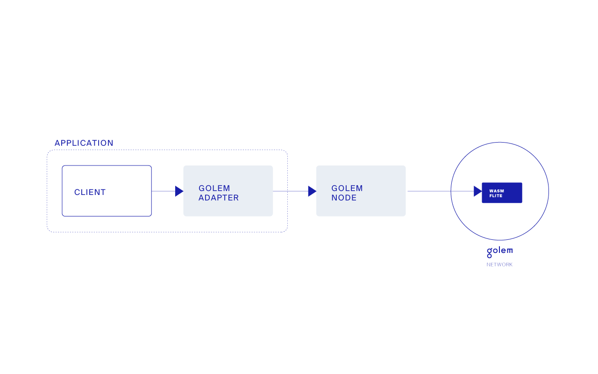

# Building gWASM applications

#### Why integrate with gWASM?

?> Applications and services, both new and existing ones, can greatly benefit from gWASM. It grants them access to an external computing platform which can be used to improve performance by offloading and parallelising computations. The integrating applications are not limited in design when making use of gWASM (however, the offloaded computations must be executable within a WebAssembly sandbox).

#### How to integrate with gWASM?
Integrating applications with gWASM is not very different from [creating gWASM tasks](Products/gWASM/gWASM-tasks). The idea is to automate the whole process, so the application creates and controls tasks in Golem. The benefit of Golem is its support for massive parallel computations. But there is no universal way to parallelize arbitrary computation. Therefore, it is the application's job to define a way for splitting the work into subtasks, similar to the map-reduce pattern.

There is more than one approach to integrating your applications with gWASM. While it's possible to build an integration from scratch, we've prepared helper libraries and example applications to make the process easier for developers.

The simplest way of creating gWASM applications is using [gwasm-runner](Products/gWASM/gWASM-applications?id=gwasm-runner) as a framework. The runner offers a simple API for defining how a task should be split and merged, along with integrations with the Golem network and Golem Unlimited working out of the box.

For applications which require more custom logic or cannot be easily ported to use `gwasm-runner` there is also[gwasm-rust-api](https://github.com/golemfactory/gwasm-rust-api) - a lower level adapter for communicating with a Golem instance running locally. Lastly, you can also write your own integration code communicating with a Golem node via RPC.

#### g-flite design

This section is focused on the design. Its intention is to demonstrate how to integrate with gWASM. For information on g-flite itself see [this](Products/gWASM/Sample-application).



It is clear that there are two main components. First one is flite cross-compiled to WebAssembly. It serves as backend and is executed on providers' remote machines. Second one is the client. It is written in Rust. It serves as user interface and connects to Golem Node in order to send Golem tasks.

* The client is the user interface. It is also responsible for splitting input data into chunks for subtasks and combining subtasks results into one result. There is no general way of splitting and combining data, they are use case specific. For that reason it is placed in the client.

* Golem adapter creates, manages and completes Golem tasks. It creates `task.json` file, creates input folder and connects to Golem Node. It contains `golem-rpc-api` library that handles sole communication with Golem Node.

* Golem Node exposes RPC interface that is used for communication. It has to be local for the client.

* WASM flite program is flite program cross-compiled to WebAssembly. It is executed remotely by providers' Golem Nodes. Communication between requestor's Golem Node and providers' Golem Nodes is handled by Golem Network. Moreover, a provider's Golem Node manages execution of WASM flite program and sends results back to the requestor's Golem Node.

Remark: WASM flite program is not stored at requestor's Golem Node before the task is dispatched. The client sends WASM flite binaries along with the task and then it is executed at provider's machine.

#### How to build custom gWASM application

1. Write backend logic of your application. Supported languages are C and Rust for now. 

2. Cross-compile backend component in compliance with gWASM requirements.

3. Test it by sending gWASM task to testnet Golem.

4. Develop Golem adapter, very similar to g-flite's Golem adapter but obviously with different API.

5. Develop a client component / user interface that invokes Golem adapter.

Remark. Defining Golem adapter API is very important part of gWASM application.

#### How to integrate an application with gWASM

This section is a very brief guidelines how to integrate existing application with gWASM. It is very hard to say which application are eligible. For sure you need to have source code and not every programming language is supported - is able to be cross-compiled to WebAssembly. Optionally, you can rewrite selected parts in C or Rust and cross-compile them.

1. Decompose the application and consider which component is responsible for heavy computations. Files access is permitted but network access, GPU access, IPC, searching volumes etc are denied.

2. Cross-compile this component in compliance with gWASM requirements.

3. Test it by sending gWASM task to testnet Golem.

4. Develop Golem adapter, very similar to g-flite's Golem adapter but obviously with different API. API should imitate original components API. Asynchronous calls are preferable due to Golem tasks' nature.

5. Combine Golem adapter with the rest of the application. And gWASM application is ready to go.


Remark. Accessing Golem requires Golem specific parameters like `subtask_timeout` or `bid`. You need to add such configuration to the application. 


---

## How to compile gWASM application

Many applications can be compiled to WASM. It is hard to say if a specific code is eligible. That may depend on used syscalls. Sometimes compilation requires some tweaks. If your application just reads data, makes computations and writes results, it is highly likely that it can be compiled to WASM. It is required to install emscripten. Note that WebAssembly is evolving very fast and it is expected to be more adaptive in time. It is also possible to compile Rust source code directly to WASM. Below you can find detailed instructions [on cross-compiling of C and Rust code](Products/gWASM/Building-gWASM-applications?id=cross-compilation). Note that gWASM applications are executed in the [sandbox](Products/gWASM/Sandboxing) and compilation must comply to its requirements.

> Be sure that you are not violating any licenses or property rights, you take legal responsibility for your actions and it is absolutely fine if you use open source software or your own code.

---

### Limitations

* All supported applications need to be single threaded. 

* Forks, IPC calls and synchronization are not allowed. It is convenient to run multiple instances of an application on multi core CPU.

* You cannot rely on time and date operations. They are mocked for the sake of determinism.

* All computations are limited to CPU, you cannot access to GPU.

* You cannot rely on randomness in order to generate cryptography or secrets. Moreover, in order to preserve determinism in the future, we will strive at providing the same source of entropy to all providers involved in verification of a WASM task. This way, the task will have access to real entropy and the determinism on providers’ machines will be preserved.

* All files are mapped to RAM memory. So having input and output files size in total greater than a few GB is not supported. 


---


## Cross compilation

Let us create a simple `hello world` style program which will read in some text from `in.txt` text file, read your name from the command line, and save the resultant text in `out.txt`. We'll demonstrate how to cross-compile apps to Wasm for use in Golem in two languages of choice: C and Rust.


### C/C++

```C
#include <stdio.h>

int main(int argc, char** argv) {
  char* name = argc >= 2 ? argv[1] : "anonymous";
  size_t len = 0;
  char* line = NULL;
  ssize_t read;
  
  FILE* f_in = fopen("in.txt", "r");
  FILE* f_out = fopen("out.txt", "w");
  
  while ((read = getline(&line, &len, f_in)) != -1)
      fprintf(f_out, "%s\n", line);
  
  fprintf(f_out, "%s\n", name);
  
  fclose(f_out);
  fclose(f_in);
  
  return 0;
}
```

There is one important thing to notice here. The sandbox communicates the results of computation by reading and writing to files. Thus, every Wasm program is required to at the very least create an output file. If your code does not include file manipulation in its main body, then the Emscripten compiler, by default, will not initialise JavaScript `FS` library, and will trip the sandbox. This will also be true
for programs cross-compiled [from Rust](Products/gWASM/Building-gWASM-applications?id=rust).

Now, we can try and compile the program with Emscripten. In order to do that you need Emscripten SDK installed on your system. For instructions on how to do it, see [here](https://emscripten.org/docs/getting_started/downloads.html).

```
emcc -o simple.js -s BINARYEN_ASYNC_COMPILATION=0 simple.c
```

Emscripten will then produce two files: `simple.js` and `simple.wasm`. The produced JavaScript file acts as glue code and sets up all of
the rudimentary syscalls in JavaScript such as `MemFS` (in-memory filesystem), etc., while the `simple.wasm` is our C program cross-compiled to Wasm.

?> *This flag will be not needed after the next release of Golem* Note here the compiler flag `-s BINARYEN_ASYNC_COMPILATION=0`. By default, the Emscripten compiler enables async IO lib when cross-compiling to Wasm which we currently do not support. Therefore, in order to alleviate the problem, make sure to always cross-compile with `-s BINARYEN_ASYNC_COMPILATION=0` flag.

### Rust

With Rust, firstly go ahead and create a new binary with `cargo`

```rust
cargo new --bin simple
```

Then go ahead and paste the following to `simple/src/main.rs`
file

```rust
use std::env;
use std::fs;
use std::io::{self, Read, Write};

fn main() -> io::Result<()> {
    let args = env::args().collect::<Vec<String>>();
    let name = args.get(1).map_or("anonymous".to_owned(), |x| x.clone());

    let mut in_file = fs::File::open("in.txt")?;
    let mut contents = String::new();
    in_file.read_to_string(&mut contents)?;

    let mut out_file = fs::File::create("out.txt")?;
    out_file.write_all(&contents.as_bytes())?;
    out_file.write_all(&name.as_bytes())?;

    Ok(())
}
```

As was the case with [C program](Products/gWASM/Building-gWASM-applications?id=cc), it is important to notice here that the sandbox communicates the results of computation by reading and writing to files. Thus, every Wasm program is required to at the very least create an output file. If your code does not include file manipulation in its main body, then the Emscripten compiler, by default, will not initialise JavaScript `FS` library, and will trip the sandbox.

In order to cross-compile Rust to Wasm compatible with Golem's sandbox, firstly we need to install rustc 1.38.0 toolchain which includes fastcomp backend for `wasm32-unknown-emscripten` target

```bash
rustup toolchain add 1.38.0
```

Then, we need to install the required target which is `wasm32-unknown-emscripten`. The easiest way of doing so, as well as generally managing your Rust installations, is to use [rustup](https://rustup.rs/)

```rust
rustup target add wasm32-unknown-emscripten --toolchain 1.38.0
```

Note that cross-compiling Rust to this target still requires that you have Emscripten SDK installed on your system. For instructions on how to do it, see [here](https://emscripten.org/docs/getting_started/downloads.html).

Now, we can compile our Rust program to Wasm. Make sure you are in the root of your Rust crate, i.e., at the top of `simple` if you didn't change the name of your crate, and run

```rust
cargo +1.38.0 rustc --target=wasm32-unknown-emscripten --release -- \
  -C link-args="-s BINARYEN_ASYNC_COMPILATION=0"
```

If everything went OK, you should now see two files:

`simple.js` and `simple.wasm` in `simple/target/wasm32-unknown-emscripten/release`.

Just like in [C program](Products/gWASM/Building-gWASM-applications?id=cc)'s case, the produced JavaScript file acts as glue code and sets up all of the rudimentary syscalls in JavaScript such as `MemFS` (in-memory filesystem), etc., while the `simple.wasm` is our Rust program cross-compiled to Wasm.

Again, note here the compiler flag `-s BINARYEN_ASYNC_COMPILATION=0` passed as additional compiler flags to `rustc`. By default, when building for target `wasm32-unknown-emscripten` with `rustc` the compiler will cross-compile with default Emscripten compiler flags which require async IO lib when cross-compiling to Wasm which we currently do not support. Therefore, in order to alleviate the problem, make sure to always cross-compile with `-s BINARYEN_ASYNC_COMPILATION=0` flag.

### How to cross-compile C program - step by step

?> Step by step instructions of how to cross-compule C program to WASM and send it to Golem.

1. Test if Emscripten SDK is installed. Open terminal and execute

```bash
emcc --version
```

If it is not installed, follow the instructions from [here](https://emscripten.org/docs/getting_started/downloads.html).

2. Create simple program `hello.c`

```C
#include <stdio.h>

int main(int argc, char** argv) {
  char* name = argc >= 2 ? argv[1] : "anonymous";

  FILE* f_out = fopen("out.txt", "w");

  fprintf(f_out, "hello %s!\n", name);

  fclose(f_out);

  return 0;
}
```

3. Do cross-compilation with `emcc`

```bash
emcc -o hello.js -s BINARYEN_ASYNC_COMPILATION=0 hello.c
```

4. You should get outcome files `hello.js` and `hello.wasm`